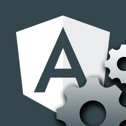

# Angular-Schule: Extension Pack

Useful extensions for Angular development with [Visual Studio Code](https://code.visualstudio.com/).  
Please install this pack before our workshop.

## Installation

Launch VS Code Quick Open (Ctrl+P), paste the following command, and press enter.
* [`ext install angular-schule-extension-pack`](https://marketplace.visualstudio.com/items?itemName=angular-schule.angular-schule-extension-pack)

## What's inside?

This extensions contains the following extensions in one single pack:

* [`ext install tslint`](https://marketplace.visualstudio.com/items?itemName=eg2.tslint)
* [`ext install ng-template`](https://marketplace.visualstudio.com/items?itemName=Angular.ng-template)
* [`ext install autoimport`](https://marketplace.visualstudio.com/items?itemName=steoates.autoimport)
* [`ext install EditorConfig`](https://marketplace.visualstudio.com/items?itemName=EditorConfig.EditorConfig)
* [`ext install vscode-icons`](https://marketplace.visualstudio.com/items?itemName=robertohuertasm.vscode-icons)
* [`ext install debugger-for-chrome`](https://marketplace.visualstudio.com/items?itemName=msjsdiag.debugger-for-chrome)
* [`ext install path-intellisense`](https://marketplace.visualstudio.com/items?itemName=christian-kohler.path-intellisense)

## Feedback

Questions, Suggestion, Complains?  
Please write a mail to `team@angular.schule`.

