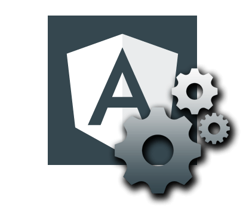
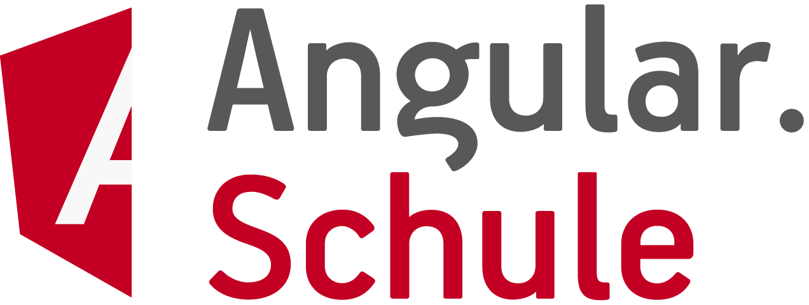

# Angular-Schule: Extension Pack

Useful extensions and settings for Angular development with [Visual Studio Code](https://code.visualstudio.com/).  
Please install this pack before our workshop.

## Changelog

I update the settings and the list of extensions from time to time.
Here is the [CHANGELOG](https://github.com/angular-schule/vscode-angular-schule-extension-pack/blob/master/CHANGELOG.md).

## Installation

Launch VS Code Quick Open (Ctrl+P), paste the following command, and press enter.
* [`ext install angular-schule-extension-pack`](https://marketplace.visualstudio.com/items?itemName=angular-schule.angular-schule-extension-pack)

## What's inside?

This extensions contains the following **extensions** in one single pack:

* [TSLint](https://marketplace.visualstudio.com/items?itemName=eg2.tslint)
* [Angular Language Service](https://marketplace.visualstudio.com/items?itemName=Angular.ng-template)
* [EditorConfig for VS Code](https://marketplace.visualstudio.com/items?itemName=EditorConfig.EditorConfig)
* [Debugger for Chrome](https://marketplace.visualstudio.com/items?itemName=msjsdiag.debugger-for-chrome)
* [Path Intellisense](https://marketplace.visualstudio.com/items?itemName=christian-kohler.path-intellisense)
* [Bracket Pair Colorizer](https://marketplace.visualstudio.com/items?itemName=CoenraadS.bracket-pair-colorizer)
* [Auto Rename Tag](https://marketplace.visualstudio.com/items?itemName=formulahendry.auto-rename-tag)
* [AngularDoc for Visual Studio Code](https://marketplace.visualstudio.com/items?itemName=AngularDoc.angulardoc-vscode)
* [Material Icon Theme](https://marketplace.visualstudio.com/items?itemName=PKief.material-icon-theme)
* [CSS Formatter](https://marketplace.visualstudio.com/items?itemName=aeschli.vscode-css-formatter)

This extension will also change the following **User Settings** (configuration in `settings.json`) to prepare the IDE for the workshop:

```json
{
    "workbench.iconTheme": "material-icon-theme",
    "files.autoSave": "onFocusChange"
}
```


## Feedback

Questions, Suggestion, Complains?  
Please write a mail to `team@angular.schule`.

----------



### &copy; 2018 http://angular.schule

